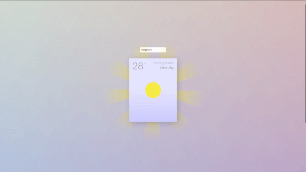

# WeatherApp
Displays city's weather using OpenWeatherMAP API

## Installation

```bash
cd weatherapi
pip install -r requirements.txt
```
## Usage

```bash
cd weatherapi
python manage.py runserver 8081
```
app url - http://localhost:8081/weather

## Demo



github - https://github.com/AsfanUlla/WeatherApp
